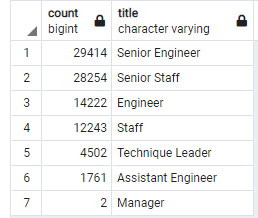
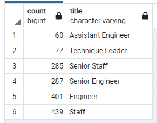
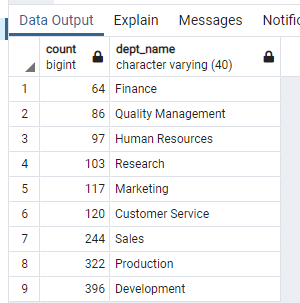

# Pewlett-Hackard-Analysis

## Overview
Pewlett Hackard is offering retirement package for it's employees that meet the criteria and its starting to think about which positions will need to be filled in the near future. 

### Purpose
The purpose of this analysis is to determine the number of retiring employees per title and identify employees who are eligible to participate in a mentorship program. 

## Analysis

A database was created on PostgreSQL using six csv files with various information on departments and employees. Required data was retrieved from the database using SQL.

Data Source: CSV files - [departments.csv](Data/departments.csv), [employees.csv](Data/employees.csv), [salaries.csv](Data/salaries.csv), [titles.csv](Data/titles.csv),[dept_manager.csv](Data/dept_manager.csv), [dept_emp.csv](Data/dept_emp.csv)

Software used: PostgreSQL 11.10, SQL

Analysis Code: [Schema](Queries/schema.sql), [Employee Database SQL Queries](Queries/Employee_Database_challenge.sql)

## Results

**Titles held by Current Employees born between Jan 1, 1952 and Dec 31, 1955.** 
- There are 133,776 titles that were held by current employees born between Jan 1, 1952 and Dec 31, 1955. 

**Unique Titles of Current Employes born between Jan 1, 1952 and Dec 31, 1955.**

- There are 90,398 current employees who are at the retirement age.  

**Number of Employees Retiring with each Title.**
- The total number of employees at the age of retirement for each title is listed in the following table.  

**Employees Eligible for the Mentorship Program.**
- There are 1546 employees eligible for the Mentorship Program. 

## Summary

### How many roles will need to be filled as the "silver tsunami" begins to make an impact?

The following code can be used to determine how many roles need to be filled as the "silver tsunami" begins to make an impact: 

        SELECT COUNT(ut.emp_no) FROM unique_titles AS ut;
        
The total number of employees eligible for retirement are 90398 as listed in the results under the Unique Titles section. 

### Are there enough qualified, retirement-ready employees in the departments to mentor the next generation of Pewlett Hackard employees?

The number of retiring employees are 90398 and the number of mentors are 1546. Thats roughly 60 times more employees that are retiring than that are mentor ready. There aren't enough qualified, retirement ready employees in the departments to mentor the next generation of Pewlett Hackard employees. 

### Two additional queries and tables that may provide more insight.
Pewlett Hackard could benefit from furthur analysis into which titles and departments may require more mentors. 

**Mentors by Title**
The following code can be used to determine which titles may require more mentors. 

        SELECT COUNT(me.emp_no), me.title
        FROM mentorship_eligibility AS me
        GROUP BY me.title
        ORDER BY COUNT(me.emp_no);
    
The above code produces the output below:

From the above table, we can determine that the number of employees that are mentor eligible with each title. However, there are many titles missing from this table. A query that lists all the titles in the company may also be helpful in determinining which titles need mentors. 

Additionally, a query to group titles by their departments may also be helpful. Employees may be able to mentor new employees with different titles in the same department (Provided they are familiar which the work and/or there is a overlap in responsibilities).

**Mentors by Department**
The following query can be used to determine the number of eligible mentors in each department. 

        -- Create a mentorship eligibility by department table 
        SELECT DISTINCT ON (e.emp_no) e.emp_no, 
            e.first_name, 
            e.last_name, 
            e.birth_date,
            de.from_date, 
            de.to_date, 
            t.title, 
            d.dept_name
        INTO mentors_department
        FROM employees as e
        INNER JOIN dept_emp as de
        ON (e.emp_no = de.emp_no)
        INNER JOIN titles as t
        ON (e.emp_no = t.emp_no)
        INNER JOIN departments as d
        ON (de.dept_no = d.dept_no)
        WHERE (e.birth_date BETWEEN '1965-01-01' AND '1965-12-31') AND (de.to_date = '9999-01-01')
        ORDER BY e.emp_no;

        SELECT COUNT(md.emp_no), md.dept_name
        INTO mentors_count
        FROM mentors_department AS md
        GROUP BY md.dept_name
        ORDER BY COUNT(md.emp_no);

The above code produces the following output:

